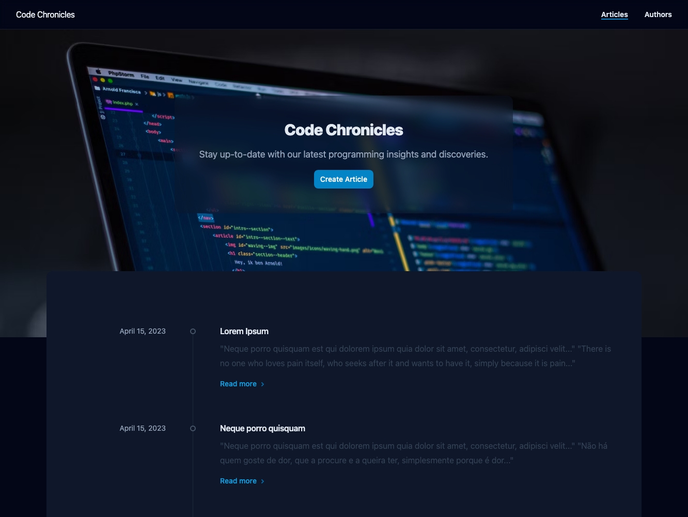
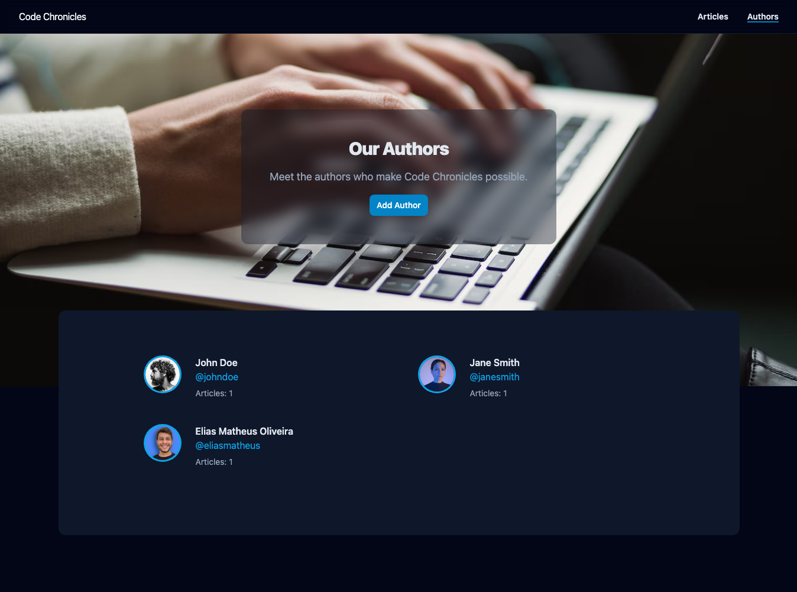
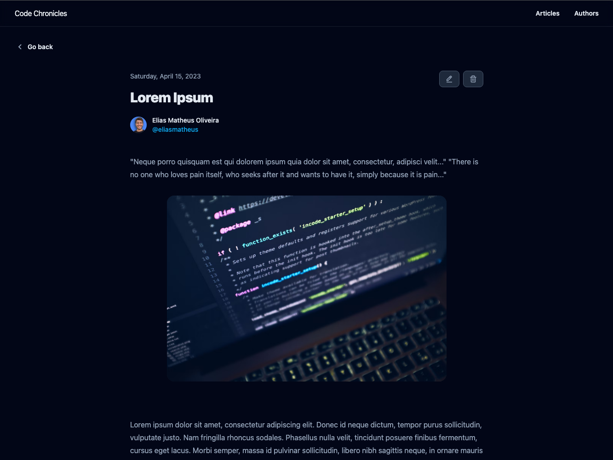
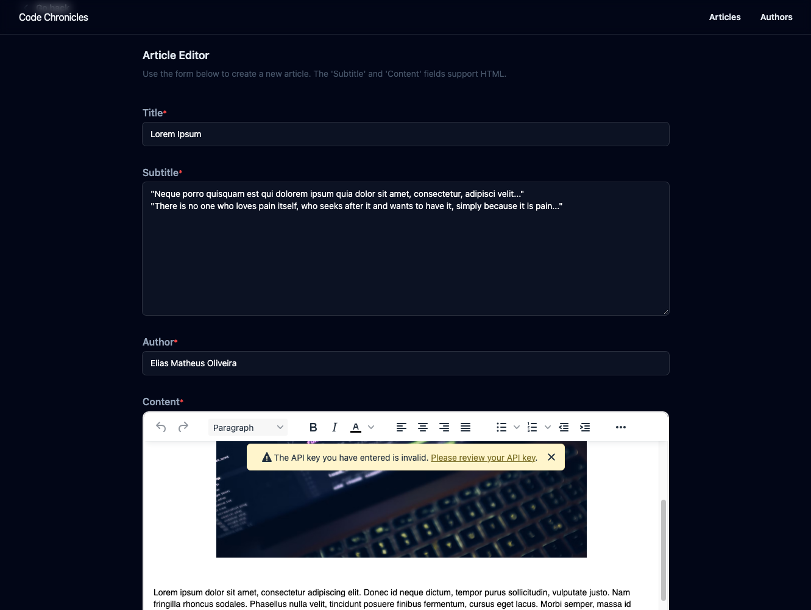

# Code Chronicles Blog


Este projeto de API e interface do usuário foi desenvolvido para a disciplina de **Desenvolvimento Full Stack Básico** do programa de pós-graduação em Desenvolvimento Full Stack da [PUC-Rio](https://www.puc-rio.br/index.html).

## Screenshots

<div align="center">
  
  
</div>

<div style="clear: both; margin-bottom: 28px;"></div>

<div align="center" style="clear: both">
  
  
</div>

<div style="clear: both"></div>

---

## Technologias

### Interface Web

- [React](https://reactjs.org/)
- [Vite](https://vitejs.dev/)
- [Tailwind](https://tailwindcss.com/)
- [Axios](https://axios-http.com/ptbr/docs/intro)
- [React Router Dom](https://reactrouter.com/web/guides/quick-start)
- [React Icons](https://react-icons.github.io/react-icons/)
- [TinyMCE](https://www.tiny.cloud/docs/)
- [React Hook Form](https://react-hook-form.com/)
- [Radix UI](https://www.radix-ui.com/docs/primitives/overview/introduction)
- [Date-fns](https://date-fns.org/)

### API

- [Flask](https://flask.palletsprojects.com/en/2.2.x/)
- [SQLAlchemy](https://www.sqlalchemy.org/)
- [Pydantic](https://docs.pydantic.dev/)
- [SQLite](https://www.sqlite.org/index.html)
- [pytest](https://docs.pytest.org/en/stable/)

## Como executar

### Pré-requisitos

Antes de começar, você vai precisar ter instalado em sua máquina as seguintes ferramentas:
[Git](https://git-scm.com), [Node.js](https://nodejs.org/en/) e [Python](https://www.python.org/).
Além disto é bom ter um editor para trabalhar com o código como [VSCode](https://code.visualstudio.com/)

```bash
# Clone este repositório
$ git clone https://github.com/eliasmatheus/simple-flask-blog
```

#### Rodando a Interface Web

```bash
# Acesse a pasta do projeto no terminal/cmd
$ cd simple-flask-blog/web

# Instale as dependências
$ npm install

# Execute a aplicação em modo de desenvolvimento
$ npm run dev

# A aplicação inciará na porta:5173 - acesse <http://127.0.0.1:5173/>
```

Abra o [http://127.0.0.1:5173/](http://127.0.0.1:5173/) para acessar a aplicação.

#### Rodando a API

Para rodar o servidor será necessário ter todas as libs python listadas no `requirements.txt` instaladas.
Após clonar o repositório, é necessário ir ao diretório raiz, pelo terminal, para poder executar os comandos descritos abaixo.

> É fortemente indicado o uso de ambientes virtuais do tipo [virtualenv](https://virtualenpython -m venv .v.pypa.io/en/latest/).

```bash
# Em outro terminal, acesse a pasta do projeto no terminal/cmd
$ cd simple-flask-blog/server

# Instale as dependências
$ pip install -r requirements.txt
# Este comando instala as dependências/bibliotecas, descritas no arquivo `requirements.txt`.

# Execute a aplicação
$ flask run --host 0.0.0.0 --port 5000
```

Em modo de desenvolvimento é recomendado executar utilizando o parâmetro reload, que reiniciará o servidor
automaticamente após uma mudança no código fonte.

```bash
# Execute a aplicação em modo de desenvolvimento
$ flask run --host 0.0.0.0 --port 5000 --reload
```

Abra o [http://localhost:5000/#/](http://localhost:5000/#/) no navegador para verificar o status da API em execução.

### Documentação da API

Ao acessar a raiz da API pelo navegador ([http://localhost:5002/](http://localhost:5002/#/)), você será redirecionado para a documentação da API.
Nesta tela você poderá escolher uma das interfaces ([Swagger](https://swagger.io/), [ReDoc](https://github.com/Redocly/redoc) ou [RapiDoc](https://rapidocweb.com/)) para testar os endpoints da API.
