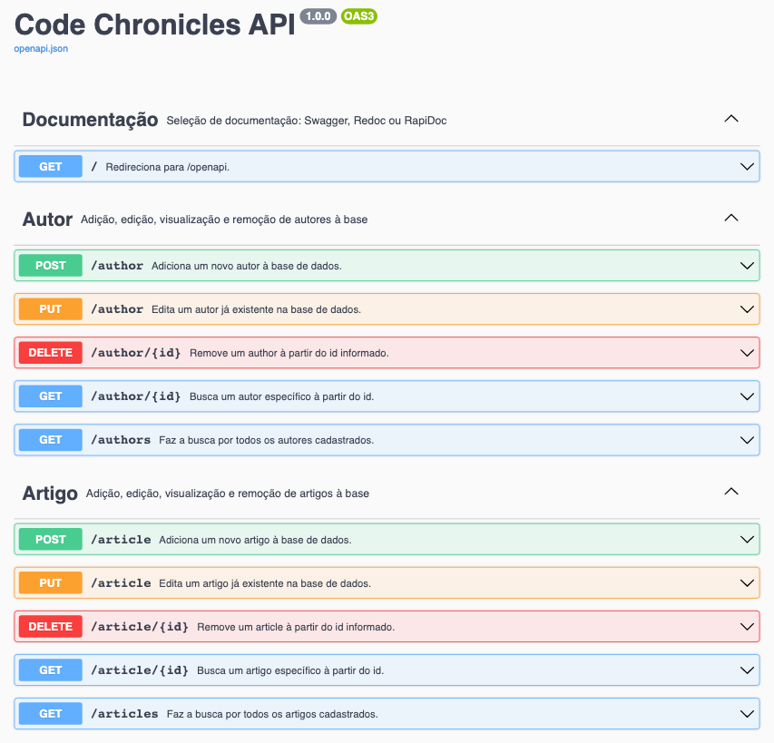

# Code Chronicles Blog API

Este projeto de API foi desenvolvido em Flask para a disciplina de **Desenvolvimento Full Stack Básico** do programa de pós-graduação em Desenvolvimento Full Stack da [PUC-Rio](https://www.puc-rio.br/index.html).

O objetivo deste projeto é fornecer uma interface de programação de aplicativos para um blog, permitindo que os desenvolvedores criem, leiam, atualizem e excluam conteúdo do blog de forma programática.

<p align="center">
  
</p>

---

## Technologias

-   [Flask](https://flask.palletsprojects.com/en/2.2.x/)
-   [SQLAlchemy](https://www.sqlalchemy.org/)
-   [Pydantic](https://docs.pydantic.dev/)
-   [SQLite](https://www.sqlite.org/index.html)
-   [pytest](https://docs.pytest.org/en/stable/)

## Como executar

Será necessário ter todas as libs python listadas no `requirements.txt` instaladas.
Após clonar o repositório, é necessário ir ao diretório raiz, pelo terminal, para poder executar os comandos descritos abaixo.

> É fortemente indicado o uso de ambientes virtuais do tipo [virtualenv](https://virtualenpython -m venv .v.pypa.io/en/latest/).

```
(env)$ pip install -r requirements.txt
```

Este comando instala as dependências/bibliotecas, descritas no arquivo `requirements.txt`.

Para executar a API basta executar:

> A aplicação usa a porta `5002` para evitar conflitos no macOS.

```
(env)$ flask run --host 0.0.0.0 --port 5002
```

Em modo de desenvolvimento é recomendado executar utilizando o parâmetro reload, que reiniciará o servidor
automaticamente após uma mudança no código fonte.

```
(env)$ flask run --host 0.0.0.0 --port 5002 --reload
```

Abra o [http://localhost:5002/#/](http://localhost:5002/#/) no navegador para verificar o status da API em execução.

## Como testar

### Documentação da API

Ao acessar a raiz da API pelo navegador ([http://localhost:5002/](http://localhost:5002/#/)), você será redirecionado para a documentação da API.
Nesta tela você poderá escolher uma das interfaces ([Swagger](https://swagger.io/), [ReDoc](https://github.com/Redocly/redoc) ou [RapiDoc](https://rapidocweb.com/)) para testar os endpoints da API.

### Testes unitários

Para executar os testes unitários, basta executar o comando:

```
(env)$ python -m pytest
```

### Rodando a interface do blog

Para rodar a interface web, acesse o repositório do [frontend](https://github.com/eliasmatheus/simple-flask-blog-web) e siga as instruções.
